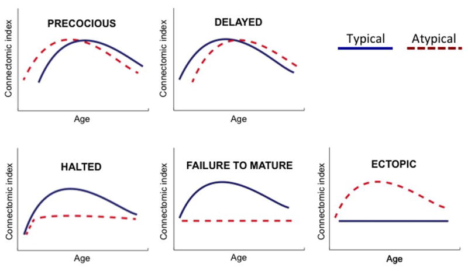
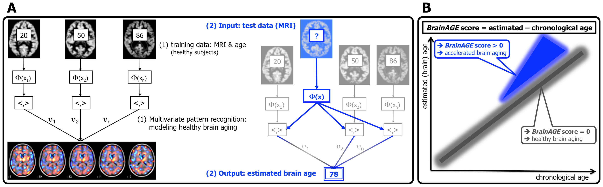

General Thoughts:
* What level should this be written at? E.g., talk in terms of k-space or less
  technically?
* Add section on datasets used for SVR modeling
* Talk in terms of distinctions between "motion CONTROL" (prospective) and "motion
  CORRECTION" (retrospective)? Not sure if this terminology is widely adopted
  but I kind of like it.
* Don't talk too much about rs-fMRI.
* Add some bibliometrics

## The importance of brain developmental trajectories

* Many psychiatric conditions now viewed as neurodevelopmental disorders.
* The promise of mental "growth charts" is personalized "interventions at
  the developmental trajectory itself, rather than at cross-sectional symptoms." Focusing on the trajectory rather than the symptoms is important since clinical signs and symptoms often appear "relatively late in the disease process."
* In context of cortical volume, "CV variation at any one point in time is
  often a poorer marker of brain maturation, sexual dimorphism, and pathology
  than variation in how CV changes over time."
  [[source]](http://www.jneurosci.org/content/31/19/7174.full)
* "cross-sectional and longitudinal effects in neuro-anatomical measurements are relatively small, making them easily obscured by distortions arising from patient and subject movement. In addition to lowering sensitivity, motion can also introduce systematic bias into statistical comparisons, since groups are commonly defined according to behavioral, clinical, and developmental variables that relate to differing levels of movement during data collection" [[source]](http://lcn.salk.edu/publications/Revelant%20Publications/Brown%20-%20Prospective%20motion%20correction%202010.pdf)
* Obtaining and working with longitudinal datasets involving neonatal, infant, pediatric, and
  adolescent populations is challenging, and even more so when dealing with
  subpopulations with psychiatric conditions.
* Head movement and MRI. Use ADHD as example. ([Cortical Gray Matter in
  Attention-Deficit/Hyperactivity Disorder: A Structural Magnetic Resonance
  Imaging Study](http://www.ncbi.nlm.nih.gov/pmc/articles/PMC2829134/))
* Good stuff on the challenges (and importance of addressing these challenges) involved with using pediatric populations in imaging studies is 
  [here](http://www.ncbi.nlm.nih.gov/pmc/articles/PMC4834255/)

> Mental illnesses are disorders of life trajectories beginning before birth and extending into older age. Longitudinal trajectory-based studies of the origins of mental illness during early development are the key to better diagnostic 
and treatment tools for mentally ill patients. Had researchers taken a cross-
sectional approach, they might
 not have found the important 
link between genetic variation, clinical outcome, and cortical
 thickness in ADHD presented 
in Section I. Variation between individuals 
can mask detection of subtle, but potentially 
important developmental shifts within individuals over time. While cross group 
comparisons at set time points can address mechanisms 
of development, they detect 
developmental dynamics that may be critical but
 variable across individuals. Longitudinal 
studies involve examining changes in behavior and brain processes over a developmental 
course within individuals, and can identify 
change within a developmental process or 
clinical symptom and link it to genetic de
terminants and neural correlates. Looking 
longitudinally, particularly over key transition 
points, may help elucidate the similarities 
and differences between periods
 of development, and determine which periods are more 
vulnerable to disruption. Longitudinal analyses 
could also have important implications in 
therapeutic decisions (e.g., whether a mental illness should be treated similarly in children 
and adults), and could help clinicians devel
op individualized treatment, taking into account 
not only the trajectory of healthy development, but also adapting treatments to a patient's 
individual circumstances. Finally, longitudinal studies of high-risk individuals that do not 
develop psychopathology may be valuable in elucidating protective factors, and serve as the 
basis for developing novel therapeutics. 
>
> Ultimately, the goal of research in this ne
w field is to prevent mental illness from 
developing and, barring that, to have early and 
effective intervention strategies that are 
adaptable for each patient. One way to approach 
this goal is to target interventions at the 
developmental trajectory itself, rather than at
 cross-sectional symptoms. Identification of 
deviations from typical trajectories in neurochemical development (e.g., serotonergic 
transmission in autism) may provide a basis 
for interventions targeted toward specific 
developmental periods. The great promise is
 that interventions will guide altered 
developmental trajectories back to a more typi
cal path, diminishing treatment needs in later 
life. 
The results of the NIMH-funded North Amer
ican Prodrome Longitudinal Study (NAPLS) 
highlight the potential of clinical epidemiology in predicting which youth are more or less 
likely to develop schizophrenia (Addington, et
 al., 2007). Youth who 
are going to develop 
psychosis can be identified before their illness becomes full-blown 35 percent of the time, if 
they meet widely accepted criteria for risk. Th
e NAPLS study shows that this figure rises to 
between 65 and 80 percent if youth have certain combinations of risk factors: deteriorating 
social functioning; family history of psychosis 
paired with recent decline in ability to 
function; increase in unusual thoughts; increase in suspicion/paranoia; and, past or current 
drug abuse. Knowing what these risk factors 
are—particularly combin
ations of them—can 
help scientists predict who is likely to devel
op the illnesses within two to three years with 
the same accuracy that other kinds of risk fa
ctors can predict major medical diseases, such 
as diabetes. This type of work will be critical to early identification, and possible 
prevention or early intervention in at-risk individuals with complex mental illness. 
>
> [source](http://www.nimh.nih.gov/about/advisory-boards-and-groups/namhc/neurodevelopment_workgroup_report_33553.pdf)

* [Unraveling the Miswired Connectome: A Developmental Perspective](http://www.cell.com/neuron/references/S0896-6273%2814%2900780-6)
* [Transformative Neurodevelopmental Research in 
Mental Illness ](http://www.nimh.nih.gov/about/advisory-boards-and-groups/namhc/neurodevelopment_workgroup_report_33553.pdf)
* [Quantile rank maps: A new tool for understanding individual brain
  development](http://www.sciencedirect.com/science/article/pii/S1053811915000130)
* [Trajectories of cortical thickness maturation in normal brain
  development--The importance of quality control procedures](http://www.ncbi.nlm.nih.gov/pubmed/26463175)
* [Methods and considerations for longitudinal structural brain imaging
  analysis across development](http://www.sciencedirect.com/science/article/pii/S1878929314000310)
* [Developmental brain trajectories in children with ADHD and controls: a
  longitudinal neuroimaging study](http://www.ncbi.nlm.nih.gov/pmc/articles/PMC4787204/)
* [Quantitative MRI of the temporal lobe, amygdala, and hippocampus in normal
  human development: ages 4-18 years](http://www.ncbi.nlm.nih.gov/pubmed/8698883)
* [How Does Your Cortex Grow?](http://www.ncbi.nlm.nih.gov/pmc/articles/PMC3157294/)

## Structural Differences in Children with ADHD

### ROIs to Consider
* Basal Ganglia Regions
  * Globus Pallidus
  * Putamen
  * Caudate

### Papers
* [A review of attention-deficit/hyperactivity disorder from the perspective of
  brain networks](http://www.ncbi.nlm.nih.gov/pmc/articles/PMC3654209/)
* [Differences in brain structure and memory suggest adolescents may not "grow out of" ADHD](http://www.cam.ac.uk/research/news/differences-in-brain-structure-and-memory-suggest-adolescents-may-not-grow-out-of-adhd)
* [Structural brain change in Attention Deficit Hyperactivity Disorder
  identified by
  meta-analysis](http://bmcpsychiatry.biomedcentral.com/articles/10.1186/1471-244X-8-51)

## Previous findings with T1, quantitive relaxometry, DTI, DKI, NODDI, rs-fMRI and trajectories – brain age prediction

### Quantitative Relaxometry Mapping

Probably focus on Deoni et al.'s MWF and mcDESPOT stuff on WM development from
infancy -> early childhood.

* [Quantitative MRI for studying neonatal brain development](https://www.researchgate.net/profile/Revital_Nossin-Manor/publication/250924259_Quantitative_MRI_for_studying_neonatal_brain_development/links/0deec51f4c548b3d87000000.pdf)
* [T2 Relaxometry of Normal Pediatric Brain Development](http://www.ncbi.nlm.nih.gov/pmc/articles/PMC2767196/)
* [Investigating white matter development in infancy and early childhood using myelin water faction and relaxation time mapping](http://www.ncbi.nlm.nih.gov/pmc/articles/PMC3711836/)
* [Structural MRI connectome in development: challenges of the changing brain](http://www.ncbi.nlm.nih.gov/pmc/articles/PMC4075590/)
* [High-resolution diffusion kurtosis imaging at 3T enabled by advanced
  post-processing](http://www.ncbi.nlm.nih.gov/pubmed/25620906)
* [Optimized Workflow for Diffusion 
Kurtosis Imaging of Newborns](http://visielab.uantwerpen.be/sites/default/files/Kudzinava_2011_ISBI_ppt.pdf)

### DTI

* [Predicting age of human subjects based on
structural connectivity from di usion tensor imaging](http://arxiv.org/pdf/1405.5260.pdf)
* [Growth trajectory of the early developing brain derived from 
longitudinal MRI/DTI data](http://depts.washington.edu/bicg/documents/MICCAI-2009-IADB-Gerig.pdf)
* [Quantitative evaluation of brain development using anatomical MRI and
  diffusion tensor imaging](http://www.sciencedirect.com/science/article/pii/S0736574813001019)

> Diffusion MRI is very sensitive to motion, due to phase shifts induced microscopically by diffusion-driven water molecular displacements, and macroscopically by head motion, cardiac pulsation and breathing. This sensitivity increases with the intensity and duration of gradient pulses, which are characterized by the b-value, the scalar that defines the amount of diffusion weighting in the experiment (Le Bihan et al., 2001). It can be reduced by synchronizing the acquisition with the source of motion, monitoring using “navigator echoes,” using specific protocols, applying real-time prospective motion and outlier detection methods; however, all of these may raise other problems such as increased acquisition times (Ordidge et al., 1994; Pipe, 1999; Kennedy and Zhong, 2004; Zwiers, 2010; Zhou et al., 2011b; Kober et al., 2012; Ling et al., 2012). Even though it is also possible, and even advisable, to correct subject motion using preprocessing techniques (see in preprocessing steps below), the best approach is still to use comfortable padding to adjust the participant's head, and to inform the subject in advance about the noise and the vibration of the bed. This vibration was recently reported as the cause of another artifact, known as vibration artifact. During the acquisition, strong gradients are applied causing low-frequency mechanical resonances of the MR system that lead to small brain tissue movements. When these movements occur in the direction of the diffusion-encoding gradient, phase offsets will occur inducing signal dropouts in DWI images. This kind of artifacts can be reduced increasing TR (with the drawback of reducing SNR) or using full k-space coverage combined with parallel imaging (e.g., GRAPPA) (Gallichan et al., 2010). It can also be compensated using methods such as phase-encoding reversal (COVIPER) (Mohammadi et al., 2012), implemented in Artifact Correction in Diffusion MRI (ACID) toolbox. [[source]](http://www.ncbi.nlm.nih.gov/pmc/articles/PMC3594764/)

### DKI

* http://ajnrdigest.org/diffusional-kurtosis-imaging-developing-brain/
* http://visielab.uantwerpen.be/sites/default/files/Kudzinava_2011_ISBI_ppt.pdf
* http://www.ajnr.org/content/35/4/808.long
* [Preliminary Evidence of Altered Gray and White Matter Microstructural Development in the Frontal Lobe of Adolescents With Attention-Deficit Hyperactivity Disorder: A Diffusional Kurtosis Imaging Study](http://onlinelibrary.wiley.com/doi/10.1002/jmri.22397/pdf)

### rs-fMRI

* [Methods to detect, characterize, and remove motion artifact in resting
state fMRI](http://cogns.northwestern.edu/cbmg/motion%20in%20resting%20state%20NI%202014.pdf)
* If a general overview of the current state of motion correction in rs-fMRI
  studies is needed, [this](http://www.ncbi.nlm.nih.gov/pubmed/25462692/)
  overview is probably what to cite.

### Modeling

#### Datasets

##### ADHD-200 Sample Preprocessed Data (Burner)

##### ABIDE

#### Regression Analysis

#### BrainAGE Prediction

BrainAGE is a general, well-validated, kernel regression-based modeling framework that allows researchers to predict a subject's chronological 
age from sMRI data. 

Describe SVR or kernel methods in more detail here? Assume these are known to all? Could cite
[this](http://alex.smola.org/papers/2004/SmoSch04.pdf)
tutorial if something is needed.

BrainAGE actually uses relevance vector regression, but probably don't need to
go into this.

Given a dataset of whole-brain sMRI data, BrainAGE can be used to assess
neurodevelopment as follows:
* Dimensionality reduction via PCA
* LOOCV:
  * Train SVR with PCA-reduced features on training set of T1-weighted structural scans.
  * Use SVR to predict age of individuals in the test set.
  * Calculate BrainAGE Score (= predicted age - chronological age)
  * ...
* Profit

Applications:
* [Chronological age of children and adolescents](http://www.neuro.uni-jena.de/pdf-files/Franke-NI12.pdf)
* [Accellerated atrophy after TBI](http://www.ncbi.nlm.nih.gov/pmc/articles/PMC4403966/)
* [MCI -> Alzheimer's conversion](http://journals.plos.org/plosone/article?id=10.1371/journal.pone.0067346)
* [Multivariate Analyses Applied to Healthy Neurodevelopment in Fetal, Neonatal,
  and Pediatric MRI](http://www.ncbi.nlm.nih.gov/pmc/articles/PMC4720794/)

## Impact of head motion on trajectories

General distinction drawn between bulk (inter-volume) and micro (intra-volume)
movements.

[This](http://pubs.rsna.org/doi/10.1148/rg.313105115?url_ver=Z39.88-2003&rfr_id=ori:rid:crossref.org&rfr_dat=cr_pub%3dpubmed)
paper isn't directly related to the effects of motion on developmental
trajectories, but it's a great overview of MR image artifacts (including head
motion) more generally.

* Quantifying developmental trajectories relies on high-resolution structural
scans.
* Acquisition of high-resolution, whole-brain structural scans takes minutes, not seconds.
* This provides plenty of time for a subject to move during the acquisition of
  the volume.
* Some effects of this intra-volume motion
  (stolen from [here](http://onlinelibrary.wiley.com/doi/10.1002/hbm.23180/abstract)):
  * Blurring
  * Ghosting
  * Series of displaced image repetitions usally in the phase-encoded
  applications.

Explain effects of *inter*- vs. *intra*-volume motion. fMRI tends to focus on
inter-volume motion, whereas sMRI tends to be concerned with intra-volume
"micro-motion."

* [Subtle in-scanner motion biases automated measurement of brain anatomy from
  in vivo MRI](http://onlinelibrary.wiley.com/doi/10.1002/hbm.23180/abstract)
* http://blogs.discovermagazine.com/neuroskeptic/2014/12/19/head-motion-structural-scans/#.VyD8qSaVvCI
* http://www.ncbi.nlm.nih.gov/pmc/articles/PMC3563110/

### Effects of Head Motion on qMRI Maps

According to the Deoni
[review](http://www.ncbi.nlm.nih.gov/pmc/articles/PMC3613135/), artifacts
caused by bulk movement and blood flow "bleed through" to relaxation time
maps:
> "Motion can be particularly troublesome in single slice acquisitions, where
  the slice location may differ between inversion times, echo times, or flip
  angles."

Lots of stuff about blood flow messing up the steady-state assumption
accelerated measurement methods like DESPOT use. Probably ignore this...

## Motion correction strategies

Lots of research papers exclude motion-corrupted data. Everyone knows throwing
away data is costly but it may be worthwhile to acknowledge this strategy.

* http://mriquestions.com/reducing-motion-artifacts.html
* http://www.ncbi.nlm.nih.gov/pmc/articles/PMC3320676/

Two general methods: 
* **Retrospective:** Use information about the subject’s motion to estimate what k-space data would have been measured if the subject had not moved during scanning. 
* **Prospective:** Use motion-tracking data acquired during the scan to follow the subject with the gradient axes of the sequence, measuring the desired k-space data directly. 

[Navigator scans](http://mriquestions.com/navigator-echoes.html) require additional time, and this "time penalty" also comes up
in PMC techniques that "estimate volunteer motion via the MRI signal...This
time penalty is particularly problematic for rapid imaging sequences, such as
Fast Low Angle Single Shot (FLASH) that have little or no dead time."[[source]](http://journal.frontiersin.org/article/10.3389/fnins.2015.00097/full) Pretty
sure FLASH is just another name for a sequence used with despot approximations,
so should probably explore this a bit.

### Prospective correction – measure during scan and adjust scanning parameters

Prospective motion correction works by employing pulse sequences that modify
the location of data acquisition at each timepoint; i.e., real-time updating of
the pulse sequence. In other words, it aims to "prevent the damage" rather than
"reduce the damage."

All of the following advantages and disadvantages/challenges of PMC are taken
from this review: 
* [Prospective motion correction of high-resolution magnetic resonance imaging
  data in children](http://www.ncbi.nlm.nih.gov/pmc/articles/PMC3146240/)

#### Advantages

* Flexibility: can be applied to most imaging and spectroscopy sequences as
  long as external tracking system is used.
* Ensure data consistency and adequate sampling: fov follows object, so brain
  can't move out of imaging volume.
* Account for spin-history effects
* Images available instantly: useful for real-time fMRI but also sMRI

#### Disadvantages/Challenges

* Quality of tracking data
* Marker fixation
* MR compatibility
* Higher-order motion
* B0 inhomogeneities
* Gradient imperfections
* Nyquist ghost correction in EPI
* B1 sensitivity profiles
* The rigid body assumption
* The global correction problem
* Validation of results: No uncorrected reference image exists (cf. RMC) -> "This is
  problematic in terms of the adoption and acceptance of the technique, because
  it will be difficult to show in patient studies (where controlled, repeatable motion cannot be use)  that the technique is truly helpful."

Talk about
[PROMO](http://lcn.salk.edu/publications/Revelant%20Publications/Brown%20-%20Prospective%20motion%20correction%202010.pdf)? Talk about spiral navigator scans?

* [Prospective motion correction of high-resolution magnetic resonance imaging
  data in children](http://www.ncbi.nlm.nih.gov/pmc/articles/PMC3146240/)
* http://ifa.hawaii.edu/~baranec/tt/Prospective_Motion_Correction_in_Brain_Imaging.pdf
* http://www.ncbi.nlm.nih.gov/pmc/articles/PMC3320676/
* http://journal.frontiersin.org/article/10.3389/fnins.2015.00097/full

### Retrospective – impossible sMRI (Update: It's possible)

RMC for sMRI involves breaking up the long scan needed for high-resolution
T1-weighted images into a series of shorter scans, each resulting in images
with lower SNR than the image that would be produced by one long scanning
session. These low(er) SNR images are then averaged, resulting in a structural
image with a higher SNR and motion correction. The reference for this procedure is
>here](http://onlinelibrary.wiley.com/doi/10.1002/hbm.20235/abstract).

* [Apparently not impossible with sMRI](https://brainder.org/2012/05/17/retrospective-motion-correction-for-structural-mri/)
* http://hannes.nickisch.org/papers/articles/loktyushin13mrimocorr.pdf
* http://cbs.fas.harvard.edu/science/core-facilities/neuroimaging/information-investigators/MRphysicsfaq#moco_struct

### Some techniques that try to minimize head motion artifacts during reconstruction

TODO: Find some good reference on "autofocusing" techniques.
[This](http://www.ncbi.nlm.nih.gov/pmc/articles/PMC3376676/)? Are autofocusing
techniques specifically applied to non-rigid motion? If so, probably minimize
this because [this](http://www.ncbi.nlm.nih.gov/pubmed/22570274) mentions
that: "There is plenty of work remaining on non-rigid motion, although we see
this more as a niche application in brain imaging, given that most of the
problem cn be solved by rigid correction."

> Additionally, it is possible to combine [prospective and retrospective] methods so that retrospective processing corrects residual errors in the prospective system. A retrospective system can access all of the k-space data while performing reconstruction; a prospective system must necessarily rely only on previous measurements to estimate the current position of the patient. However, a prospective system avoids the need to estimate missing k-space data, allowing for direct reconstruction while avoiding possible sources of estimation error in the k-space data. [source](http://www.ncbi.nlm.nih.gov/pmc/articles/PMC3320676/)

* [Mitigation of Motion Artifacts in Functional MRI: A Combined Acquisition, Reconstruction and Post Processing Approach](https://deepblue.lib.umich.edu/bitstream/handle/2027.42/62439/kpandey_1.pdf?sequence=1)

### Group level – include as covariate

> In any case, if motion estimates are available, a correlation analysis among motion and other predictors should always be performed and any co-linearity should be reported. High co-linearity between predictors makes it difficult to disentangle their effects and is symptomatic of insufficient information, which cannot be rectified by simple data manipulation. In this case, inclusion of a motion co-variate into the statistical model can shadow any real effects. This is problematic, as in many settings motion can be expected to be correlated with the variable of interest (disease severity, age, drug dose etc.).
> 
> Collecting several structural scans and manually selecting one without motion artifacts for the structural analysis seems to be a commonly used option even in the presence of a costly increase in scan time. This procedure can reduce the spurious motion effect, but does not completely eliminate it. Furthermore, it is difficult in many study groups to obtain even a single scan without visible motion artifacts. While a visual inspection of automatically generated results is always recommended, it is often up to the individual expert to decide whether to exclude or repeat a scan or not. Since even small and visually inconspicuous, yet consistent, motion artifacts might bias the results, we believe that reducing motion during the scan is currently the best option. Controlling for motion in the statistical analysis is a second alternative that ideally should go hand in hand with a correlation analysis between motion and the predictors of interest. [[source]](http://www.ncbi.nlm.nih.gov/pmc/articles/PMC4300248/)

Global signal regression also used. Potential problem in rs-fMRI studies
looking at iFC since global signal could be meaningful. Also, doesn't completely
get rid of problem.

